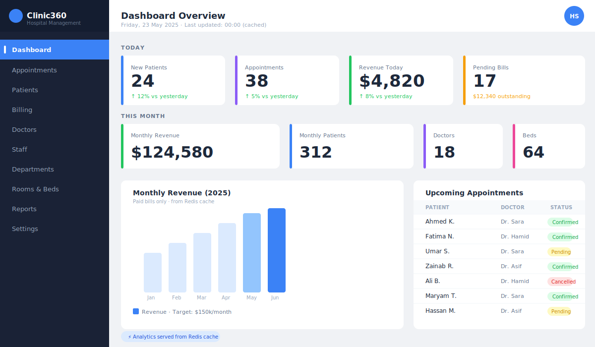
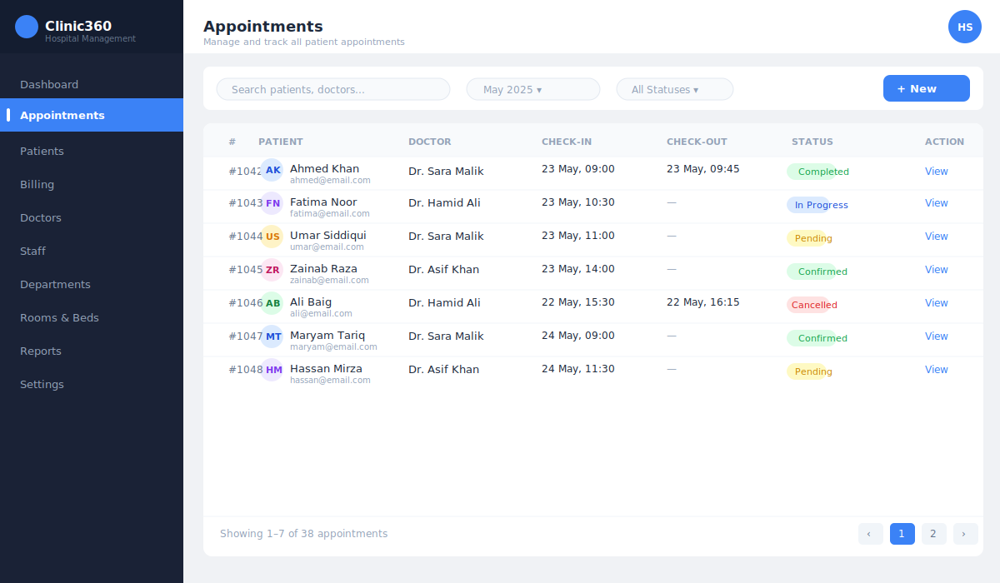
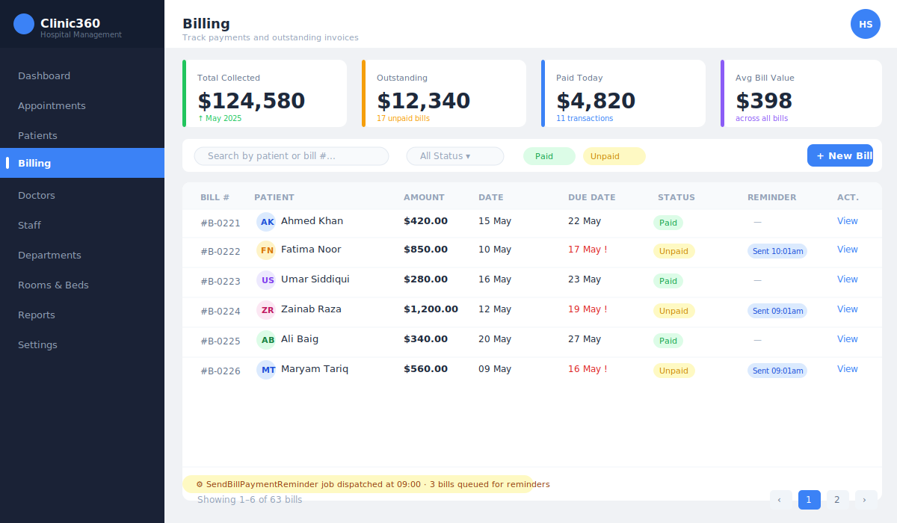

# Clinic360 — Hospital Management System

> A production-grade hospital management platform built with Laravel 10, Livewire, Redis caching, and a full queue/notification pipeline. Covers the full operational lifecycle of a clinic: patient management, appointments, billing, RBAC, and automated communications.

---

## Screenshots

### Analytics Dashboard


### Appointment Management


### Billing Overview


---

## Features

| Area | What it does |
|------|--------------|
| **RBAC** | Role-based access control with `CheckRole` middleware supporting variadic roles (`role:admin,doctor`) |
| **Appointments** | Full CRUD with Livewire — create, assign doctor, track check-in/check-out |
| **Billing** | Generate bills, mark payments, track outstanding amounts |
| **Queue Jobs** | Appointment reminders, bill payment reminders, nightly report generation |
| **Notifications** | Queued mail notifications with retries and exponential backoff |
| **Redis Cache** | Daily analytics cached for 24 hours; dashboard never hits DB on every load |
| **Scheduler** | Laravel scheduler fires nightly report, appointment reminders, and bill reminders |
| **Livewire Dashboard** | Real-time analytics: today's patients, revenue, pending bills, monthly totals |
| **Patient Management** | Registration, medical history, assigned doctor, bed/room assignment |
| **Staff Management** | Doctors, nurses, employees, HODs — all with department assignment |

---

## Tech Stack

- **Backend:** Laravel 10, PHP 8.2
- **Frontend:** Livewire 3, Blade
- **Database:** MySQL 8
- **Cache / Queues:** Redis + Laravel Horizon
- **Auth:** Session-based (Laravel built-in)
- **Mail:** SMTP / Mailgun (configurable via `.env`)

---

## Architecture Highlights

### 1. RBAC Middleware

Two middlewares handle authorization:

```php
// Variadic roles — allows any of the listed roles through
Route::middleware('role:admin,doctor')->group(function () { ... });

// Admin-only guard
Route::middleware('checksuperadmin')->group(function () { ... });
```

`CheckRole` resolves the role from either a `role` relationship (`role->name`) or a direct string column, so it works regardless of the DB schema.

### 2. Queue Jobs with Retry Logic

```
SendAppointmentReminder   — 3 retries, backoff [30s, 120s, 300s]
SendBillPaymentReminder   — 3 retries, backoff [60s, 300s, 600s]
GenerateDailyReport       — idempotent, overwrites cache nightly
```

All jobs are guarded at the start of `handle()` — appointment reminders skip if the patient has no email; bill reminders skip if the bill was paid between dispatch and execution.

### 3. Redis-Cached Analytics Dashboard

```
Midnight → GenerateDailyReport job runs
         → queries DB once for all daily metrics
         → Cache::put('daily_report', $report, 24h)

Dashboard load → Cache::remember('daily_report', ...)
              → serves pre-computed data instantly
              → falls back to live query only on cold cache
```

Hundreds of admin dashboard loads per day cost exactly **one** DB query (at midnight).

### 4. Scheduler

```
00:00  — GenerateDailyReport        (regenerate analytics cache)
08:00  — SendAppointmentReminder    (appointments in next 24h)
09:00  — SendBillPaymentReminder    (bills unpaid > 7 days)
```

All tasks use `->withoutOverlapping()` to prevent concurrent runs.

---

## Installation

```bash
git clone https://github.com/Hafiz-M-Subhan/clinic360.git
cd clinic360

composer install
cp .env.example .env
php artisan key:generate
php artisan storage:link

# Configure DB, Redis, and mail in .env
php artisan migrate:fresh --seed

php artisan serve
```

**Run the queue worker:**
```bash
php artisan queue:work redis --queue=default,notifications
```

**Run the scheduler locally:**
```bash
php artisan schedule:work
```

---

## Roles

| Role | Access |
|------|--------|
| `admin` | Full access — all modules, user/role management |
| `doctor` | Appointments, patient checkups, birth/operation reports |
| `receptionist` | Appointment booking, patient registration, billing |

**Default admin credentials:**
```
Email:    hafizsubhan@test.com
Password: hafizsubhan
```

---

## Key Files

| File | Purpose |
|------|---------|
| `app/Http/Middleware/CheckRole.php` | Variadic RBAC middleware |
| `app/Jobs/GenerateDailyReport.php` | Nightly analytics cache population |
| `app/Jobs/SendAppointmentReminder.php` | Queued appointment notification dispatcher |
| `app/Jobs/SendBillPaymentReminder.php` | Queued bill payment reminder dispatcher |
| `app/Notifications/AppointmentReminder.php` | Mail notification with appointment details |
| `app/Notifications/BillPaymentDue.php` | Mail notification for outstanding bills |
| `app/Http/Livewire/Admins/Dashboard.php` | Analytics dashboard — reads from Redis cache |
| `app/Console/Kernel.php` | Scheduler — wires all jobs to cron |
| `app/Http/Controllers/RoleController.php` | Full CRUD for roles + user assignment |
| `app/Models/User.php` | `isAdmin()`, `isDoctor()`, `isReceptionist()`, `hasRole()` helpers |

---

## License

MIT
